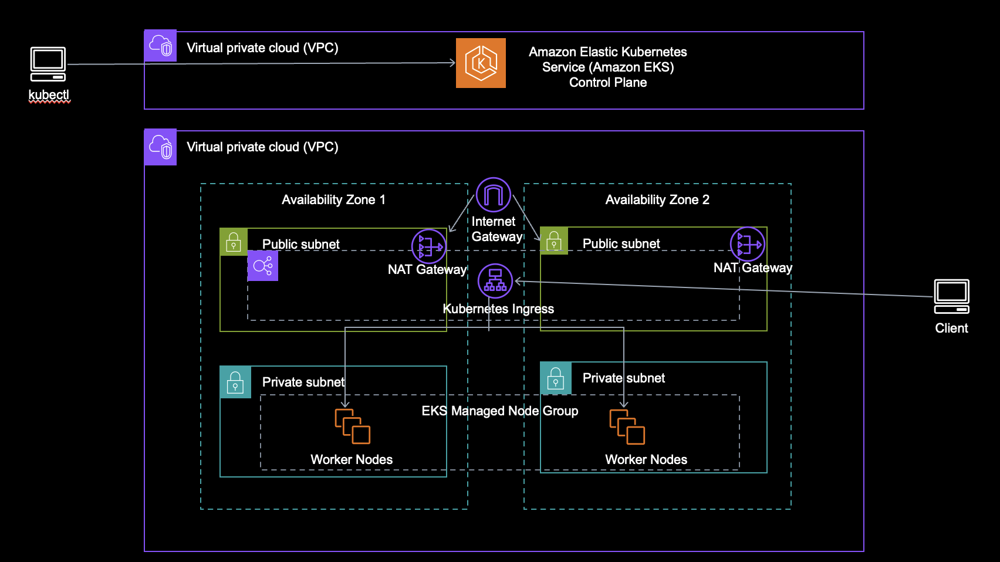

# Discussionplatform Infra EKS

## Project Overview
- This repository consists of modules to help deploy an Amazon EKS Cluster with the AWS Load Balancer Controller Configured
- I used Terraform as IaC to deploy the infrastructure

## Other Related Repos
- [Link To ECS Infra](https://github.com/JasonPauldj/DiscussionPlatform_Infra)
- [Link To Backend](https://github.com/JasonPauldj/DiscussionPlatform_SpringBoot_Hibernate)
- [Link To Frontend](https://github.com/JasonPauldj/DiscussionPlatform_ReactJS)

## Architecture Overview

## Terraform Modules Overview

| Module | Notes |
| --- | ----------- |
| ROOT | We create the Kubernetes Service Account required for the AWS Load Balancer Controller & utilize Helm to install the AWS Load Balancer Controller |
| cidrsubnets | This module is used to calculate CIDR blocks for subnets within the VPC |
| db | This module is used to create the AWS RDS MySQL resource and DB parameter groups |
| eks | This module is used to create the resources needed for EKS - Cluster, Managed Node Group for the Cluster, Add-Ons, OIDC Provider for Cluster, IAM Role for Load Balancer Controller |
| network | This module is used to create the network resources - VPC, Subnets, Route Tables, Internet Gateway, Security Groups and Security Group Rules |
| IAM | This module is used to create the IAM roles for the EKS Cluster and EKS Managed Node Group |

## Terraform Commands
- `terraform fmt -recursive .` : To format all the terraform files in the directory
- `terraform apply -auto-approve` : To build the infrastructure. Note use the -auto-approve flag if you want to skip the plan output
- `terraform destroy -auto-approve` : To bring down the infrastructure

## Kubernetes Commands
- `aws eks update-kubeconfig --region us-east-1 --name dp-cluster` : To update the context for the kubectl
- `kubectl apply -f deployment.yaml` : To create the Kubernetes Deployment
- `kubectl apply -f service.yaml` : To create the Service
- `kubectl apply -f ingress.yaml` : To create the Ingress AKA Load Balancer